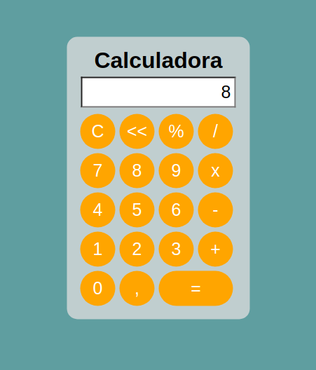

# Calculadora com JavaScript Sem Utilizar a função (eval)

Calculadora que realiza operações básicas.

## Objetivos

Criar uma calculadora que não utiliza a função nativa do JavaScript, conhecida como eval, utilizada para realizar calculos de expressões matemáticas presentes em strings e etc... Neste projeto apliquei  os conhecimentos em HTML, CSS e JAVASCRIPT, sendo os principais conceitos em JavaScript: Manipulação de arrays e Arrow Functions, for, addEventListiner, entre outros.

## Observações

`OBS: O botão de porcentagem ainda não está com função implementada.O calculo de número decimais ainda possui algums bugs, que serão tratados em atualizações futuras.`

## ScreenShots

### Home

### Expressão Matemática

### Resultado

## Autor

Mateus Souza de Jesus, Analista e desenvolvedor de sistemas.
